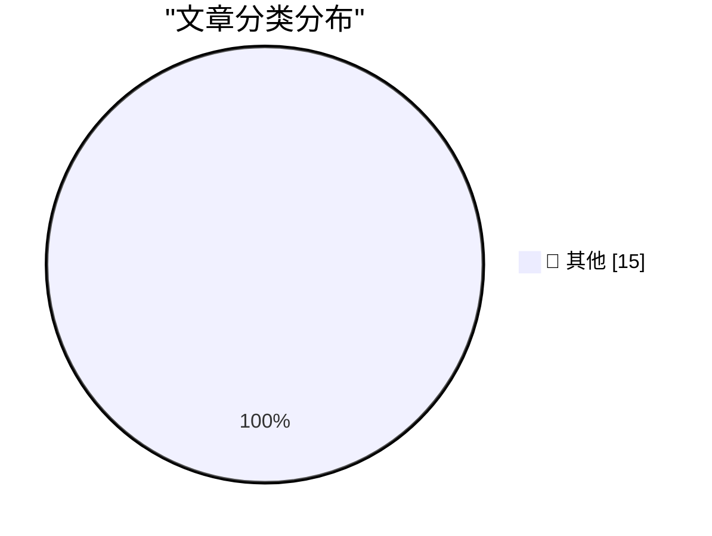

# 📰 AI 博客每日精选 — 2026-03-10

> 来自 Karpathy 推荐的 92 个顶级技术博客，AI 精选 Top 15

## 🏆 今日必读

🥇 **Production query plans without production data**

[Production query plans without production data](https://simonwillison.net/2026/Mar/9/production-query-plans-without-production-data/#atom-everything) — simonwillison.net · 13 小时前 · 📝 其他

> Production query plans without production data

🥈 **Perhaps not Boring Technology after all**

[Perhaps not Boring Technology after all](https://simonwillison.net/2026/Mar/9/not-so-boring/#atom-everything) — simonwillison.net · 15 小时前 · 📝 其他

> Perhaps not Boring Technology after all

🥉 **Quoting Joseph Weizenbaum**

[Quoting Joseph Weizenbaum](https://simonwillison.net/2026/Mar/8/joseph-weizenbaum/#atom-everything) — simonwillison.net · 1 天前 · 📝 其他

> Quoting Joseph Weizenbaum

---

## 📊 数据概览

| 扫描源 | 抓取文章 | 时间范围 | 精选 |
|:---:|:---:|:---:|:---:|
| 89/92 | 2516 篇 → 32 篇 | 48h | **15 篇** |

### 分类分布

---

## 📝 其他

### 1. Production query plans without production data

[Production query plans without production data](https://simonwillison.net/2026/Mar/9/production-query-plans-without-production-data/#atom-everything) — **simonwillison.net** · 13 小时前 · ⭐ 15/30

> Production query plans without production data

---

### 2. Perhaps not Boring Technology after all

[Perhaps not Boring Technology after all](https://simonwillison.net/2026/Mar/9/not-so-boring/#atom-everything) — **simonwillison.net** · 15 小时前 · ⭐ 15/30

> Perhaps not Boring Technology after all

---

### 3. Quoting Joseph Weizenbaum

[Quoting Joseph Weizenbaum](https://simonwillison.net/2026/Mar/8/joseph-weizenbaum/#atom-everything) — **simonwillison.net** · 1 天前 · ⭐ 15/30

> Quoting Joseph Weizenbaum

---

### 4. How AI Assistants are Moving the Security Goalposts

[How AI Assistants are Moving the Security Goalposts](https://krebsonsecurity.com/2026/03/how-ai-assistants-are-moving-the-security-goalposts/) — **krebsonsecurity.com** · 1 天前 · ⭐ 15/30

> How AI Assistants are Moving the Security Goalposts

---

### 5. [Sponsor] Finalist

[[Sponsor] Finalist](https://www.finalist.works/finalist-36/) — **daringfireball.net** · 6 小时前 · ⭐ 15/30

> [Sponsor] Finalist

---

### 6. ★ The iPhone 17e

[★ The iPhone 17e](https://daringfireball.net/2026/03/the_iphone_17e) — **daringfireball.net** · 6 小时前 · ⭐ 15/30

> ★ The iPhone 17e

---

### 7. MacBook Neo Wallpapers Now Available for All Macs in MacOS Tahoe

[MacBook Neo Wallpapers Now Available for All Macs in MacOS Tahoe](https://www.macrumors.com/2026/03/09/macos-tahoe-26-4-beta-4-neo-wallpapers/) — **daringfireball.net** · 9 小时前 · ⭐ 15/30

> MacBook Neo Wallpapers Now Available for All Macs in MacOS Tahoe

---

### 8. Low-Wage Contractors in Kenya See What Users See While Using Meta’s AI Smart Glasses

[Low-Wage Contractors in Kenya See What Users See While Using Meta’s AI Smart Glasses](https://www.svd.se/a/K8nrV4/metas-ai-smart-glasses-and-data-privacy-concerns-workers-say-we-see-everything) — **daringfireball.net** · 14 小时前 · ⭐ 15/30

> Low-Wage Contractors in Kenya See What Users See While Using Meta’s AI Smart Glasses

---

### 9. Can Coding Agents Relicense Open Source Through a ‘Clean Room’ Implementation of Code?

[Can Coding Agents Relicense Open Source Through a ‘Clean Room’ Implementation of Code?](https://simonwillison.net/2026/Mar/5/chardet/) — **daringfireball.net** · 1 天前 · ⭐ 15/30

> Can Coding Agents Relicense Open Source Through a ‘Clean Room’ Implementation of Code?

---

### 10. Donald Knuth on Claude Opus Solving a Computer Science Problem

[Donald Knuth on Claude Opus Solving a Computer Science Problem](https://www-cs-faculty.stanford.edu/~knuth/papers/claude-cycles.pdf) — **daringfireball.net** · 1 天前 · ⭐ 15/30

> Donald Knuth on Claude Opus Solving a Computer Science Problem

---

### 11. Steve Lemay Hits Apple’s Leadership Page

[Steve Lemay Hits Apple’s Leadership Page](https://www.apple.com/leadership/steve-lemay/) — **daringfireball.net** · 1 天前 · ⭐ 15/30

> Steve Lemay Hits Apple’s Leadership Page

---

### 12. GNU and the AI reimplementations

[GNU and the AI reimplementations](http://antirez.com/news/162) — **antirez.com** · 1 天前 · ⭐ 15/30

> GNU and the AI reimplementations

---

### 13. Why Am I Paranoid, You Say?

[Why Am I Paranoid, You Say?](https://idiallo.com/blog/why-am-i-paranoid?src=feed) — **idiallo.com** · 16 小时前 · ⭐ 15/30

> Why Am I Paranoid, You Say?

---

### 14. Pluralistic: Billionaires are a danger to themselves and (especially) us (09 Mar 2026)

[Pluralistic: Billionaires are a danger to themselves and (especially) us (09 Mar 2026)](https://pluralistic.net/2026/03/09/autocrats-of-trade-2/) — **pluralistic.net** · 12 小时前 · ⭐ 15/30

> Pluralistic: Billionaires are a danger to themselves and (especially) us (09 Mar 2026)

---

### 15. Book Review: There Is No Antimemetics Division by qntm ★★★★★

[Book Review: There Is No Antimemetics Division by qntm ★★★★★](https://shkspr.mobi/blog/2026/03/book-review-there-is-no-antimemetics-division-by-qntm/) — **shkspr.mobi** · 16 小时前 · ⭐ 15/30

> Book Review: There Is No Antimemetics Division by qntm ★★★★★

---

*生成于 2026-03-10 04:52 | 扫描 89 源 → 获取 2516 篇 → 精选 15 篇*
*基于 [Hacker News Popularity Contest 2025](https://refactoringenglish.com/tools/hn-popularity/) RSS 源列表，由 [Andrej Karpathy](https://x.com/karpathy) 推荐*
*由「懂点儿AI」制作，欢迎关注同名微信公众号获取更多 AI 实用技巧 💡*
