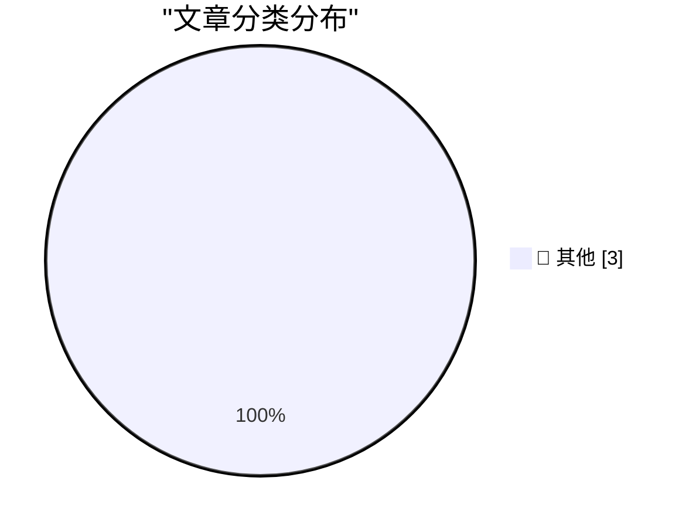

# 📰 AI 博客每日精选 — 2026-03-10

> 来自 Karpathy 推荐的 92 个顶级技术博客，AI 精选 Top 3

## 🏆 今日必读

🥇 **Production query plans without production data**

[Production query plans without production data](https://simonwillison.net/2026/Mar/9/production-query-plans-without-production-data/#atom-everything) — simonwillison.net · 13 小时前 · 📝 其他

> Production query plans without production data

🥈 **Perhaps not Boring Technology after all**

[Perhaps not Boring Technology after all](https://simonwillison.net/2026/Mar/9/not-so-boring/#atom-everything) — simonwillison.net · 15 小时前 · 📝 其他

> Perhaps not Boring Technology after all

🥉 **[Sponsor] Finalist**

[[Sponsor] Finalist](https://www.finalist.works/finalist-36/) — daringfireball.net · 5 小时前 · 📝 其他

> [Sponsor] Finalist

---

## 📊 数据概览

| 扫描源 | 抓取文章 | 时间范围 | 精选 |
|:---:|:---:|:---:|:---:|
| 89/92 | 2516 篇 → 17 篇 | 24h | **3 篇** |

### 分类分布

---

## 📝 其他

### 1. Production query plans without production data

[Production query plans without production data](https://simonwillison.net/2026/Mar/9/production-query-plans-without-production-data/#atom-everything) — **simonwillison.net** · 13 小时前 · ⭐ 15/30

> Production query plans without production data

---

### 2. Perhaps not Boring Technology after all

[Perhaps not Boring Technology after all](https://simonwillison.net/2026/Mar/9/not-so-boring/#atom-everything) — **simonwillison.net** · 15 小时前 · ⭐ 15/30

> Perhaps not Boring Technology after all

---

### 3. [Sponsor] Finalist

[[Sponsor] Finalist](https://www.finalist.works/finalist-36/) — **daringfireball.net** · 5 小时前 · ⭐ 15/30

> [Sponsor] Finalist

---

*生成于 2026-03-10 04:41 | 扫描 89 源 → 获取 2516 篇 → 精选 3 篇*
*基于 [Hacker News Popularity Contest 2025](https://refactoringenglish.com/tools/hn-popularity/) RSS 源列表，由 [Andrej Karpathy](https://x.com/karpathy) 推荐*
*由「懂点儿AI」制作，欢迎关注同名微信公众号获取更多 AI 实用技巧 💡*
